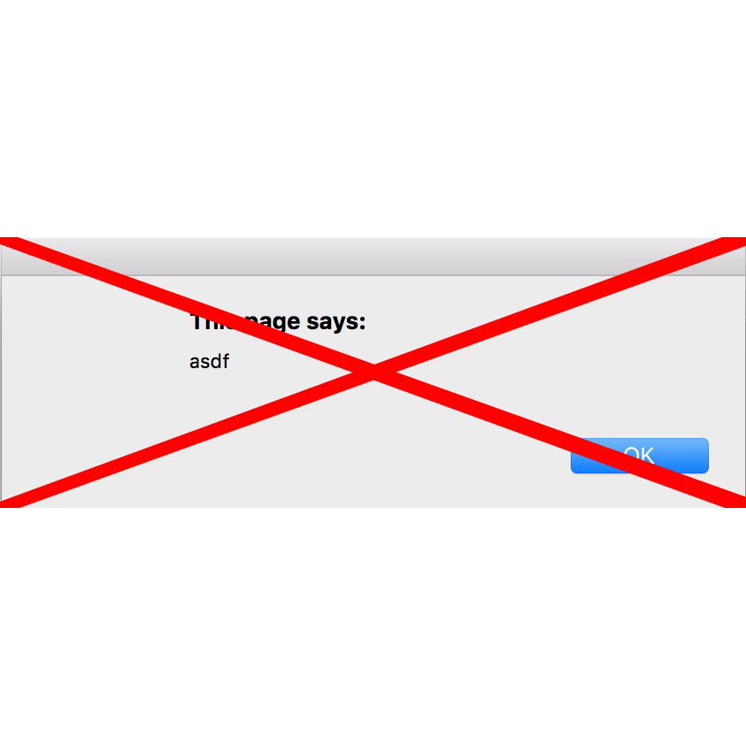

Gentle Alerts
=============

[](https://chrome.google.com/webstore/detail/gentle-alerts/bcjaadnpjolbaginfighnpcdjmbeiahn)

[ ](https://app.codeship.com/projects/203223)
[](https://codeclimate.com/github/albertyw/gentle-alerts/coverage)
[](https://codeclimate.com/github/albertyw/gentle-alerts)
[](https://gemnasium.com/github.com/albertyw/gentle-alerts)

Google chrome extension to convert alerts into gentle notifications



I started this project after getting annoyed with Google Calendar's event
notifications.  They used to have nice soft notifications, but they broke it
when they graduated their feature from google labs and they
[haven't fixed it](https://productforums.google.com/forum/#!topic/calendar/aWfZBNKlNEQ).

Testing
-------

```
npm test
```

Packaging
---------

```
npm package
```

Upload the zip file to the
[chrome web store](https://chrome.google.com/webstore/developer/dashboard).
